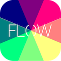
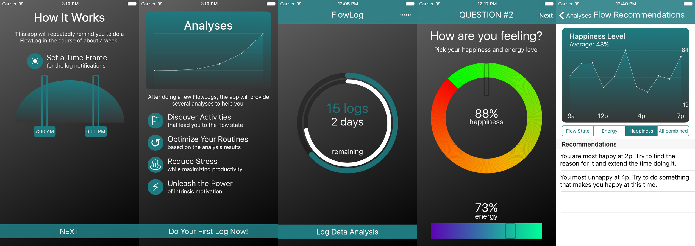

# FlowLog
> Find your flow.

This native iOS app is designed to ask you 3 questions at random times in a day:
1. What are you doing?
2. How are you feeling?
3. In which state are you in? (flow, boredom, control, relaxation, ...)

Based on the answers you give, it tries to deduce tips that help you optimize your health and well-being. This concept is based on the
theory of [Flow](https://www.amazon.de/Flow-Psychology-Experience-Perennial-Classics/dp/0061339202)
by Mihály Csíkszentmihályi. 

### Screenshots

### Prerequisites
This project uses Swift 3 and is built for iOS 9.
It uses CoreData to store the user's logs.

## License

This project is licensed under the MIT License.